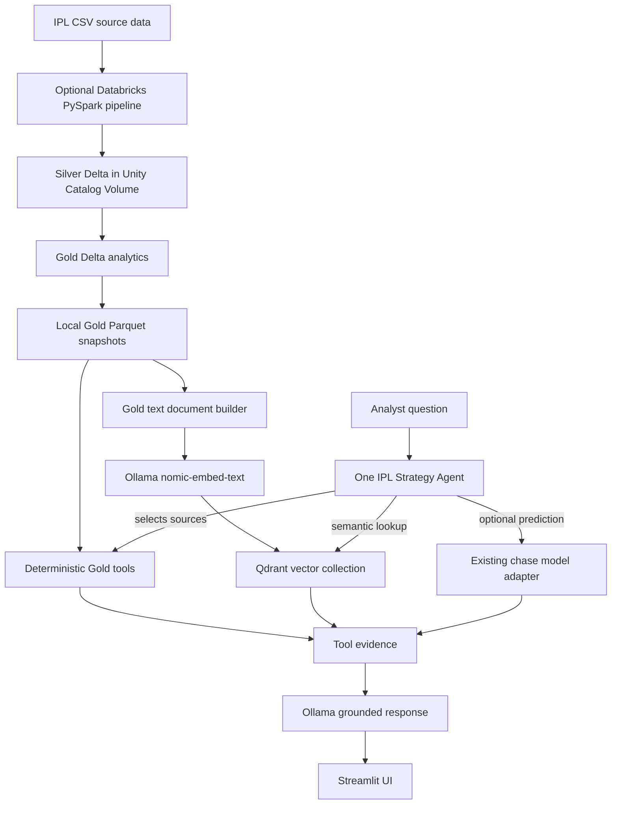

# IPL Strategy Intelligence

IPL Strategy Intelligence is a local decision-support assistant for cricket analysts. It combines deterministic statistics from IPL Gold datasets, semantic retrieval over those datasets, and an optional chase-probability model. One Ollama agent chooses sources and explains the returned evidence. Local iteration defaults to `phi3:mini`; set `OLLAMA_CHAT_MODEL=mistral` when you want Mistral responses.

The Streamlit app does **not** need Databricks credits. Databricks is an optional path for refreshing data; local development and the assistant use Gold Parquet snapshots in `data/gold/`.

## What is implemented

- Existing Databricks/PySpark incremental Silver and Gold pipeline, with Unity Catalog Volume paths and fail-fast quality checks.
- Six local Gold snapshots: player matchups, player form, team performance, toss analysis, venue strategy, and phase analysis.
- Deterministic Python analytics queries. The LLM does not calculate structured statistics.
- One Ollama planner that selects Gold tables, Qdrant retrieval, and the prediction tool (`phi3:mini` by default; Mistral is selectable).
- Gold-to-text documents, Ollama `nomic-embed-text` embeddings, stable document IDs, and named-vector Qdrant indexing/retrieval.
- A locally trained scikit-learn chase model fallback plus an adapter for loading and scoring the model artifact.
- A six-view Streamlit product UI: Overview, Player matchup, Venue & teams, Chase prediction, Strategy assistant, and Data & model.

### Current limitations

- The original fitted chase model artifact is still unavailable. A local fallback has now been trained from the supplied IPL raw CSVs. Its held-out-by-match validation ROC-AUC was 0.877; this is a new baseline for this implementation and does not reproduce the earlier model's reported ≈0.716. The local artifact is Git-ignored and must be regenerated on a fresh clone.
- The repo includes six local Gold snapshots for the assistant. The Spark pipeline has now been extended to publish those six plus `top_batsmen` and `top_bowlers`; the updated Spark aggregations still need a Databricks run to validate them against the source Volume.
- RAG indexes text derived from Gold. It does not add external commentary, ball-by-ball narratives, current rosters, or season details absent from Gold.
- `phase_analysis` has phase totals, not bowler-by-phase metrics, so it cannot rank effective death-over bowlers.

## Architecture



Python tools own calculations; Qdrant returns similar Gold text; LangChain's Ollama chat integration plans and explains evidence; Streamlit displays the response and caveats.

## Run locally

### 1. Install dependencies

Use Python 3.10 or newer in PowerShell from the project root:

```powershell
python -m venv .venv
.\.venv\Scripts\python.exe -m pip install -r requirements.txt
```

The repository includes six small Gold Parquet snapshots and the CSVs used by Overview. Raw ball-by-ball files are not included.

### 2. Configure Ollama and Qdrant

Ollama must be running. Defaults are `phi3:mini` and `nomic-embed-text`. Install them if needed:

```powershell
ollama pull phi3:mini
ollama pull nomic-embed-text
```

Switch to Mistral by setting `OLLAMA_CHAT_MODEL=mistral` in `.env` and pulling it with `ollama pull mistral`.

Copy `.env.example` to `.env` if you do not already have a local `.env`. Local defaults:

```text
OLLAMA_BASE_URL=http://localhost:11434
OLLAMA_CHAT_MODEL=phi3:mini
OLLAMA_EMBED_MODEL=nomic-embed-text
QDRANT_BACKEND=local
QDRANT_PATH=.qdrant
QDRANT_COLLECTION=ipl_gold_strategy_v2
```

`QDRANT_BACKEND=local` uses embedded Qdrant; no separate service is needed. Generated `.qdrant/` data is excluded from Git. To use Qdrant Cloud, set `QDRANT_BACKEND=cloud`, `QDRANT_URL`, and `QDRANT_API_KEY` in the ignored `.env`. Never commit `.env`.

### 3. Build or refresh the RAG index

Run after setup and whenever local Gold snapshots change:

```powershell
.\.venv\Scripts\python.exe -m rag.vector_store
```

The current local snapshot produces 795 contextual documents. The indexer embeds locally and upserts stable IDs so repeated runs update rather than duplicate points. High-cardinality batter-bowler pairs stay in deterministic queries instead of being duplicated as tens of thousands of vectors. It creates a named `text` vector. An old collection with an incompatible unnamed vector is left untouched; choose a new collection name instead.

Preview generated documents with:

```powershell
.\.venv\Scripts\python.exe -m rag.build_documents
```

### 4. Start the app

```powershell
.\.venv\Scripts\python.exe -m streamlit run dashboard/app.py
```

Open the local URL printed by Streamlit. Overview reads `data/*.csv`; the assistant reads `data/gold/*.parquet`.

## Questions to check

- `Show Kohli record against Bumrah` — deterministic `player_matchups` query.
- `Compare Virat Kohli and Rohit Sharma` — deterministic `player_form` comparison.
- `Should we chase at Wankhede against CSK?` — venue and team data, plus RAG if indexed. A live-state prediction is only available once the model is supplied or trained and all five current-state features are provided.
- `Which team has the best win percentage?` — `team_performance` ranking.
- `Does choosing to field help after winning the toss?` — `toss_analysis` values.
- `Which bowlers are effective in death overs?` — explains that current phase data cannot answer bowler-level rankings.

Expand **How this answer was produced** to see selected tools, sources, metrics, and caveats.

## How the agent works

1. The configured Ollama model selects allowed Gold tables, whether Qdrant retrieval is useful, and whether prediction is requested.
2. A local intent router adds obvious sources; table names are allow-listed.
3. `GoldAnalyticsTool` resolves player/team/venue names and queries local Parquet. Python/pandas calculate structured values.
4. `GoldRAGRetriever` embeds the question with `nomic-embed-text` and searches Qdrant when contextual retrieval is useful.
5. `PredictionTool` invokes the fitted scikit-learn model only if the artifact exists and every feature is supplied.
6. The configured Ollama model explains tool evidence. If generation is unavailable, the UI falls back to an evidence summary.
7. Streamlit shows the answer, metrics, sources, tool trace, and limitations.

There is one tool-using agent, not a group of agents. The plan and tool evidence are exposed so the response can be audited. For questions that combine overall team and venue averages into a specific recommendation, a grounding guard keeps the separate data scopes explicit.

## Chase model adapter

Put the existing fitted scikit-learn estimator/pipeline here:

```text
models/chase_model.joblib
```

Or set `CHASE_MODEL_PATH` in `.env`. The artifact must expose `predict_proba` and `feature_names_in_`. Positive class must be `1`, `True`, `win`, or `won`; otherwise the second class of a binary model is used. Questions must provide every feature as `feature_name=value`. The adapter does not guess missing live match inputs.

The original fitted model artifact was unavailable, so the supplied CSVs were used to train a local fallback. It is saved at `models/chase_model.joblib` on this machine and is ignored by Git. To reproduce training from the downloaded local files, run:

```powershell
.\.venv\Scripts\python.exe -m ml.train_chase_model `
  --matches "data/raw/Match_Info (2).csv" `
  --deliveries "data/raw/Ball_By_Ball_Match_Data (1).csv"
```

This trains an innings-2 logistic regression using run state, wickets, and balls remaining. The validation split is by match to reduce delivery-level leakage. This run reported ROC-AUC 0.877 and saved the artifact that the existing adapter loads. The older ≈0.716 baseline is a different model and is not reproduced. The agent requires explicit values for all five features (`runs_required`, `balls_remaining`, `wickets_remaining`, `current_run_rate`, and `required_run_rate`) before scoring a live state. Raw CSVs and the model artifact are ignored by Git.

## Optional Databricks data refresh

The retained pipeline expects CSVs under `/Volumes/workspace/default/ipl_data/Raw/` and writes Silver plus eight Gold Delta outputs below that Volume: the six assistant tables and `top_batsmen`/`top_bowlers`. The local app does not connect to Databricks. Copy/export updated Gold snapshots to `data/gold/` when available. The Spark code has not been executed in this environment because Databricks compute is unavailable.

The existing pipeline's schema/null/duplicate/orphan checks, match fingerprints, incremental Silver Delta merges, and Gold reconciliation are preserved; this app work does not rebuild them.

## Repository map

- `agentic/strategy_agent.py` — one Ollama planner and grounded response agent.
- `agentic/tools.py` — deterministic Gold queries and chase prediction tool.
- `agentic/analytics.py` — Gold table access, calculations, and Plotly chart helpers.
- `agentic/team_names.py`, `agentic/venue_names.py` — shared alias normalization.
- `dashboard/app.py` - dark Streamlit UI with six analyst views and evidence displays.
- `data/gold/*.parquet` — local Gold snapshots for app and RAG.
- `ml/chase_prediction.py` — model artifact adapter; `ml/train_chase_model.py` — local trainer when source CSVs are supplied.
- `pipeline/` — optional Databricks ETL and data quality checks.
- `rag/build_documents.py` — Gold rows to text documents.
- `rag/embeddings.py`, `rag/retriever.py`, `rag/vector_store.py` — Ollama/Qdrant pipeline.
- `rag/settings.py` — local/cloud configuration.
- `.env.example` — safe configuration template; `.env` contains local settings/secrets and is ignored.

## Interview explanation

> “I kept the Databricks medallion pipeline and moved application development into a local Python/Streamlit repo. The assistant reads Gold Parquet snapshots, so it runs without Databricks. One Ollama planner (`phi3:mini` locally, with Mistral configurable) chooses deterministic analytics tables, Qdrant retrieval, or the chase model. Python tools calculate structured metrics; Ollama embeddings retrieve semantically related Gold text; the chat model explains evidence with sources and limitations. Because the original chase-model artifact was missing, I trained a fallback on ball-by-ball match states and split validation by match. It achieved 0.877 ROC-AUC on that split; that result does not recreate the earlier model’s reported 0.716.”

### Design choices to explain

- **Local Gold Parquet:** separates app development from Databricks compute costs while preserving the analytics contract.
- **Deterministic queries plus RAG:** exact statistics use exact filters and arithmetic; semantic search finds related text but does not replace Python for exact answers.
- **One agent:** one planner is enough for a small, auditable toolset.
- **Visible limitations:** the assistant cannot answer dimensions absent from Gold and should say so.
- **Stable Qdrant IDs:** reindexing updates a row's point rather than duplicating it.
- **Optional prediction:** the adapter validates the model and inputs; prediction is not claimed before both exist.
