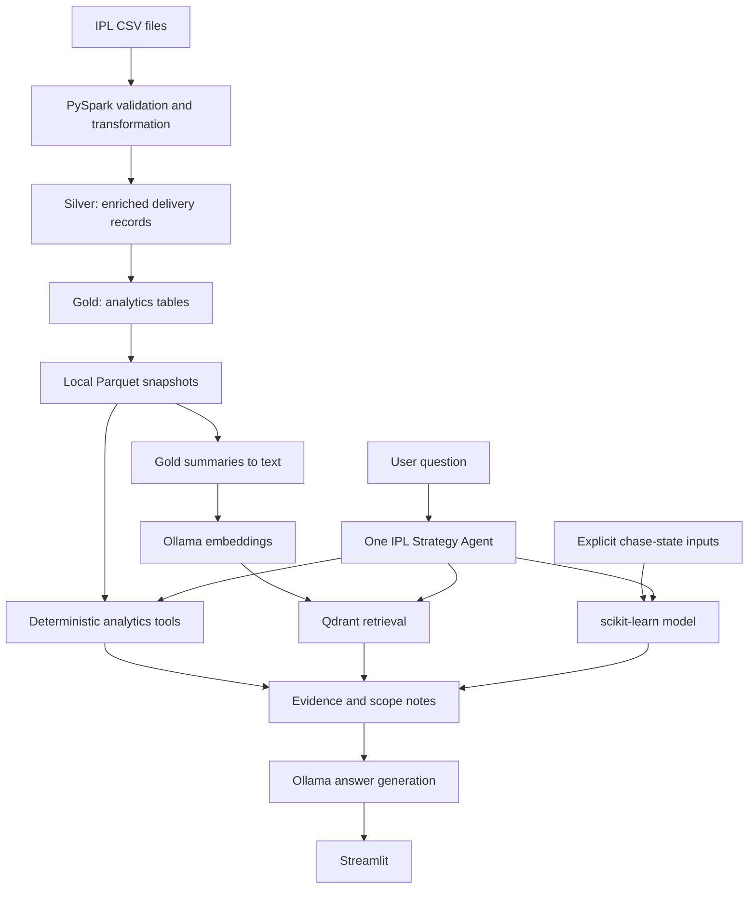

# IPL Strategy Intelligence

An IPL analytics platform that turns ball-by-ball match data into curated data products, interactive analysis, and evidence-grounded strategy answers.

The project combines a PySpark data pipeline with a local Streamlit application. One tool-using strategy agent selects deterministic analytics, semantic retrieval over Gold summaries, or a chase-state model when the question calls for it.

## What it does

- Builds a delivery-level Silver dataset from match and ball-by-ball source files.
- Produces Gold analytics for player matchups and form, teams, toss decisions, venues, innings phases, and leaderboards.
- Presents six workspaces: overview, player matchup, venue and teams, chase prediction, strategy assistant, and data/model status.
- Answers natural-language questions with one IPL Strategy Agent and multiple tools.
- Shows supporting metrics, data sources, tools used, and scope notes with assistant answers.

## Architecture



Spark builds Silver and Gold. The local app reads exported Gold Parquet snapshots and does not require a running Spark cluster. RAG is built from Gold-derived summaries; exact numeric questions are handled by deterministic Python queries.

## Data products

| Layer | Contents |
| --- | --- |
| Silver | Typed delivery records joined to match metadata |
| Gold | `player_matchups`, `player_form`, `team_performance`, `toss_analysis`, `venue_strategy`, `phase_analysis`, `top_batsmen`, `top_bowlers` |
| Local app data | Six assistant Gold Parquet snapshots plus overview CSV exports |

The pipeline includes schema and null checks, unique-key checks, match/player reference checks, season coverage checks, incremental match manifests, and source-to-Gold reconciliations.

## AI design

There is one IPL Strategy Agent, not a collection of agents. Its planner selects from a bounded set of tools:

- Gold analytics tools query structured snapshots for exact statistics.
- Qdrant retrieves relevant text documents derived from Gold summaries.
- The chase tool calls the scikit-learn model only when all required live-state features are supplied.
- Ollama generates the final explanation from the returned evidence.

The language model explains tool output; it is not the source of database counts or calculations. The application can show when evidence is missing or too broad to answer a question precisely.

## Current data notes

The reviewed local CSV snapshot contains 1,243 matches and 295,732 delivery rows dated 2008-04-18 through 2026-05-31. Local checks found unique match IDs, no orphan delivery match IDs, no exact duplicate delivery rows, and consistent total-run arithmetic. The precise provenance of the local S3 files has not been verified by checksum.

Sixteen tied matches encode Super Over deliveries using regular second-innings coordinates, and the source has no Super Over flag. Those records are retained, but some innings, matchup, and phase aggregates may include Super Over activity. Therefore, the data should not be described as perfect or every statistic as exact. The full walkthrough explains the issue and its effect.

All-time team analysis contains 15 franchise identities, including renamed and discontinued historical teams. Venue spelling and city-suffix aliases are consolidated in the application; venues that may represent different ground eras remain separate.

## Run locally

Requirements: Python 3.10+, Ollama, the local Gold snapshots, and the models `phi3:mini` and `nomic-embed-text`.

```powershell
python -m venv .venv
.\.venv\Scripts\python.exe -m pip install -r requirements.txt
if (-not (Test-Path .env)) { Copy-Item .env.example .env }
ollama pull phi3:mini
ollama pull nomic-embed-text
```

Start the Ollama service, then build or refresh the local RAG index and run the app:

```powershell
.\.venv\Scripts\python.exe -m rag.vector_store
.\.venv\Scripts\python.exe -m streamlit run dashboard/app.py
```

The chase model artifact is not tracked in Git. To train it from local raw CSV files:

```powershell
.\.venv\Scripts\python.exe -m ml.train_chase_model `
  --matches "data/raw/Match_Info (2).csv" `
  --deliveries "data/raw/Ball_By_Ball_Match_Data (1).csv"
```

See [data/README.md](data/README.md) for how local snapshots relate to the data pipeline, and [docs/PROJECT_WALKTHROUGH.txt](docs/PROJECT_WALKTHROUGH.txt) for the detailed component-by-component guide and caveats.

## Repository map

```text
agentic/       Strategy agent, analytics queries, tools and canonical names
dashboard/     Streamlit application
data/gold/     Local Parquet snapshots used by the app and RAG
ml/            Chase model training and prediction adapter
notebooks/     Spark pipeline entry point
pipeline/      Silver/Gold transformations and quality checks
rag/           Gold documents, Ollama embeddings and Qdrant indexing
docs/          Detailed plain-text project walkthrough
```

## Attribution

Copyright © 2026 @SnehaKarna. All rights reserved for project-authored code and documentation unless a separate license is added. IPL datasets and third-party software/assets remain subject to their respective owners' terms.
